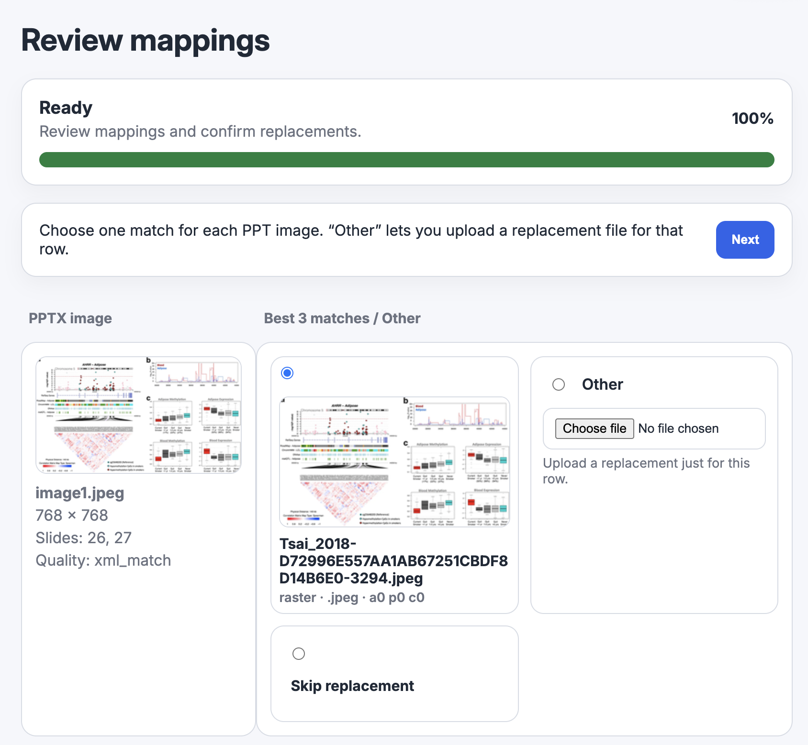
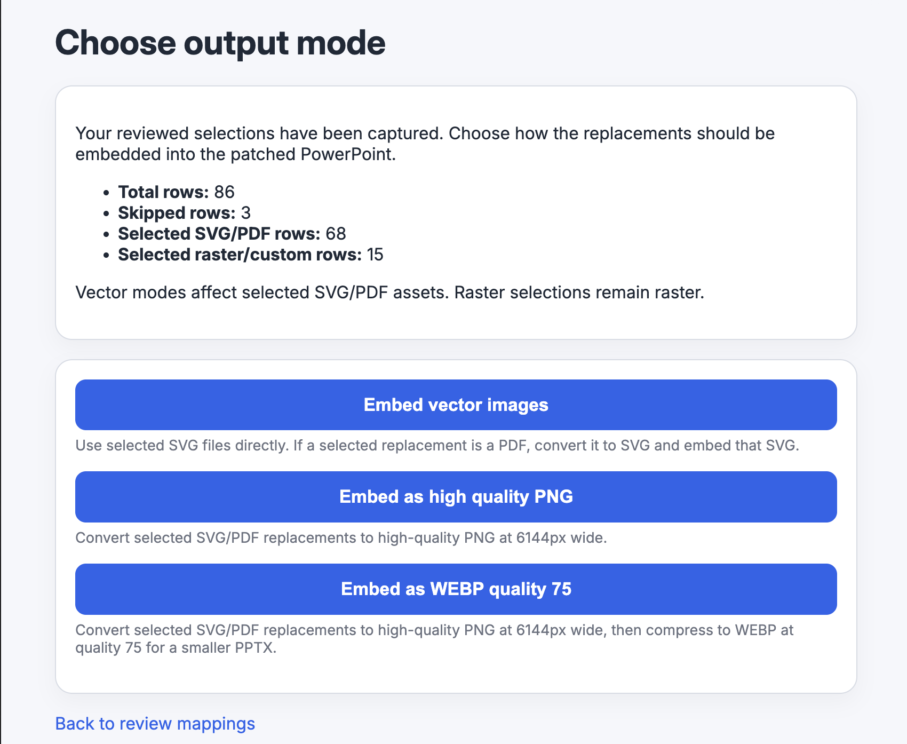

# Keynote → PPTX Image Replacer

**Restore high-quality Keynote assets into PPTX exports — replaces degraded rasters with original SVG, PDF, and full-resolution images via a local review UI.**

---

## The problem

When you export a Keynote presentation to PowerPoint, every vector graphic and high-resolution image is flattened into a compressed JPEG or PNG. The resulting PPTX can look noticeably softer or more pixelated than the Keynote original — especially for diagrams, charts, and figures that were originally SVG or PDF.

There is no built-in way to reverse this. This tool automates it.

---

## How it works

1. Upload your `.pptx` and the `.key` file it was exported from.
2. The tool parses both files — using slide structure XML and Keynote's internal protobuf data — to match each PPTX image back to its Keynote original.
3. A review UI shows you each match. Confirm, switch to a different candidate, upload your own file, or skip.
4. Choose an output format and download a patched PPTX with the originals embedded.

> **Important:** the `.pptx` must have been exported from the `.key` file. Matching an unrelated PPTX and Keynote file will produce poor results.

---

## Screenshots

**Review mappings** — each PPTX image is shown alongside its best Keynote candidates. Matches found via slide structure are pre-selected automatically.



**Choose output mode** — pick how SVG/PDF replacements are embedded into the patched PPTX.



---

## Requirements

### System dependencies

**macOS (Homebrew):**

```bash
brew install librsvg pngquant poppler
```

| Tool | Purpose |
|---|---|
| `rsvg-convert` (librsvg) | SVG → PNG conversion |
| `pngquant` | Lossy PNG compression after conversion |
| `pdftocairo` (poppler) | PDF → SVG (vector embed mode) |

**Linux:** the same tools are available via `apt` / `dnf`. Windows is not currently supported.

---

## Install

### With uv (recommended)

[uv](https://docs.astral.sh/uv/) installs the tool globally and makes `keynotepptx` available as a command:

```bash
uv tool install git+https://github.com/seanlaidlaw/keynotepptx
```

To update to the latest version:

```bash
uv tool install --reinstall git+https://github.com/seanlaidlaw/keynotepptx
```

### With pip / venv

```bash
python3 -m venv .venv
source .venv/bin/activate
pip install git+https://github.com/seanlaidlaw/keynotepptx
```

---

## Running

```bash
keynotepptx --pptx /path/to/presentation.pptx --keynote /path/to/presentation.key
```

A browser tab opens automatically. Press **Ctrl-C** to stop the server.

If `--pptx` and `--keynote` are omitted, the web UI lets you upload both files on the start page. The port defaults to 5000 and advances automatically if that port is already in use.

### All options

| Flag | Default | Description |
|---|---|---|
| `--pptx` | — | Path to the PowerPoint file |
| `--keynote` | — | Path to the Keynote file |
| `--mapping-csv` | — | Pre-load a confirmed mapping CSV from a previous run |
| `--host` | `0.0.0.0` | Host to bind the server to |
| `--port` | `5000` | Starting port (advances automatically if in use) |
| `--no-browser` | off | Don't open a browser tab on start |

### Re-using a previous mapping

After patching, a `confirmed_mapping.csv` is saved alongside the output PPTX. Pass it back on the next run to restore all your previous choices:

```bash
keynotepptx \
  --pptx /path/to/presentation.pptx \
  --keynote /path/to/presentation.key \
  --mapping-csv /path/to/confirmed_mapping.csv
```

---

## Patch modes

After reviewing matches, choose how replacements are embedded:

| Mode | Best for | Description |
|---|---|---|
| **Embed vector images** | Smallest file, infinite scalability | SVG files embedded directly; PDFs converted to SVG first. Choose this if your PPTX viewer supports embedded SVG (PowerPoint for Mac/Windows does). |
| **Embed as high quality PNG** | Maximum compatibility | SVG/PDF rasterised to PNG at 2560 px wide, compressed with pngquant. Use this if you need the file to open correctly everywhere. |
| **Embed as WEBP quality 75** | Smaller file size | Same as PNG but converted to WebP at quality 75. Smaller PPTX but slower to open in PowerPoint. |

Raster replacements (JPEG, TIFF, etc.) are embedded as-is regardless of the mode chosen. Transparency is preserved in all modes.

---

## Output

The patched PPTX downloads automatically from the browser when processing completes. A CSV report listing every replacement and its source is also available for download.
