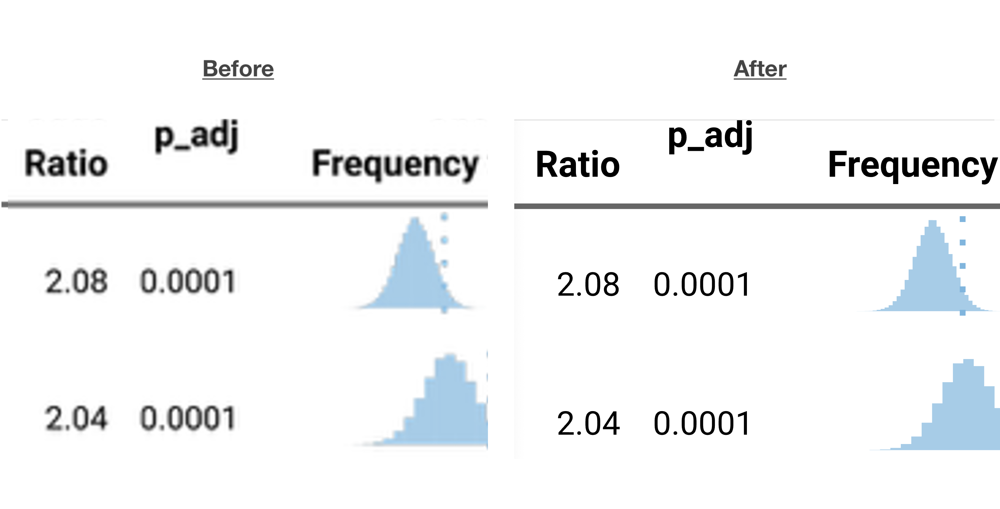
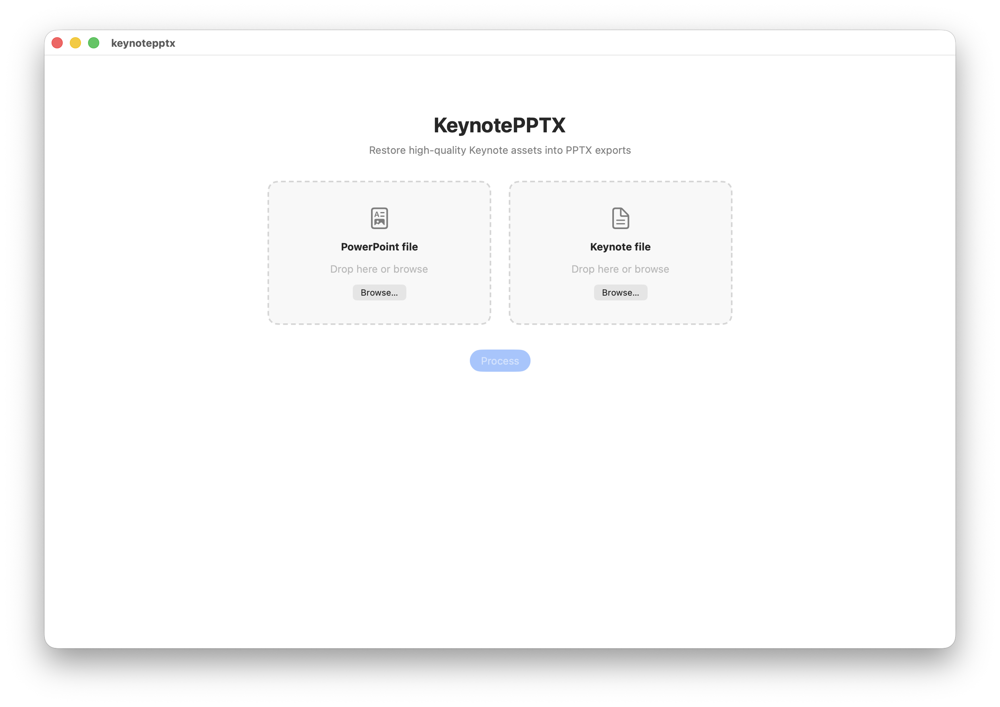
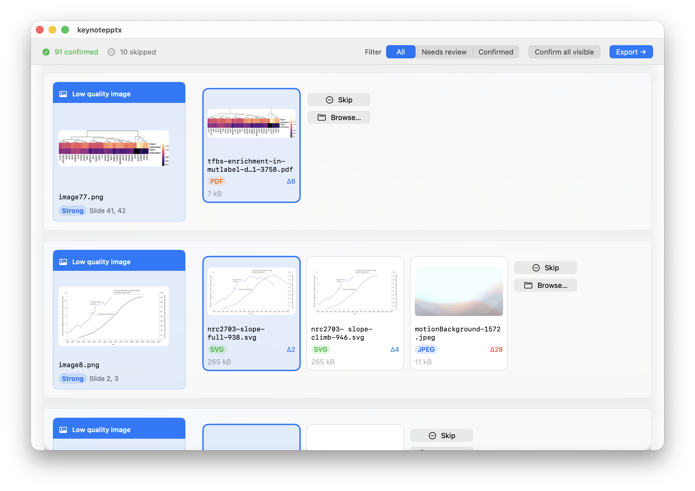
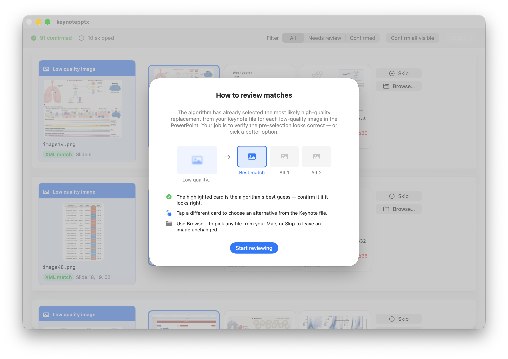
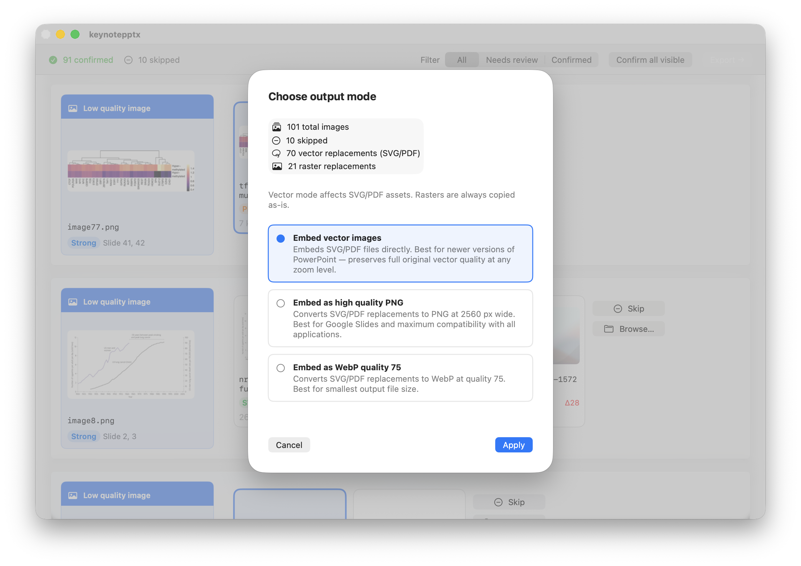
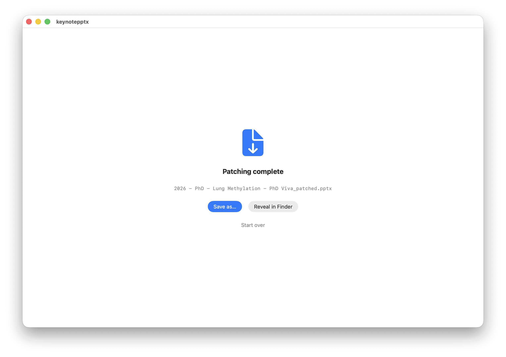

# KeynotePPTX

**Restore high-quality Keynote assets into PPTX exports — replaces degraded rasters with original SVG, PDF, and full-resolution images.**

---

## The problem

When you export a Keynote presentation to PowerPoint, every vector graphic and high-resolution image is flattened into a compressed raster. The resulting PPTX can look noticeably softer or pixelated compared to the Keynote original — especially for charts, diagrams, and figures that were originally SVG or PDF.

There is no built-in way to reverse this. KeynotePPTX automates it.

---

## How it works

1. Drop your `.pptx` and the `.key` file it was exported from.
2. The app parses both files — using slide structure XML and Keynote's internal binary format — to match each PPTX image back to its Keynote original.
3. A review screen shows you each match. Confirm, switch to a different candidate, browse for your own file, or skip.
4. Choose an output format and save a patched PPTX with the originals embedded.

> **Note:** the `.pptx` must have been exported from the `.key` file. Matching an unrelated PPTX and Keynote file will produce poor results.

---

## Download

Download the latest release from the [Releases page](../../releases). Open the DMG and drag **KeynotePPTX** into your Applications folder.

> **First launch:** macOS will warn the app is from an unidentified developer because it is not notarized. Right-click the app and choose **Open** to bypass this once.

---

## Usage

### 1. Load your files

Drop a PowerPoint file and its source Keynote file onto the two drop zones, then click **Process**.

### 2. Review matches

The app automatically selects the best Keynote replacement for each PPTX image. The review screen shows the low-quality PPTX image on the left and the top candidates from the Keynote file on the right.

The first time you reach this screen an explanation of how to review will appear. The highlighted card is the algorithm's best guess — confirm it if it looks right, tap a different candidate to switch, use **Browse…** to pick any file from your Mac, or **Skip** to leave the image unchanged.

Each candidate card shows the filename, format badge (SVG, PDF, JPEG…), file size, and a match distance score (lower is better). The toolbar shows a running count of confirmed and skipped images and lets you filter the list to show only items that still need attention.

### 3. Choose output mode

Once you click **Export**, choose how vector replacements are embedded into the patched PPTX.

| Mode | Best for | Description |
|---|---|---|
| **Embed vector images** | Smallest file, infinite scalability | SVG/PDF files embedded directly. Best for PowerPoint on Mac or Windows. |
| **Embed as high quality PNG** | Maximum compatibility | SVG/PDF rasterised to PNG at 2560 px wide. Best for Google Slides and broad compatibility. |
| **Embed as WebP quality 75** | Smallest file size | Same as PNG but converted to WebP. Smaller output but may not render in older apps. |

Raster replacements (JPEG, PNG, TIFF) are always copied as-is regardless of the mode chosen.

### 4. Save

When patching completes, save the file anywhere on your Mac or reveal it in Finder.

---

## Requirements

- macOS 14 or later
- Apple Silicon or Intel Mac
